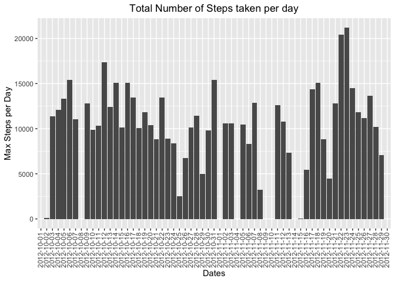
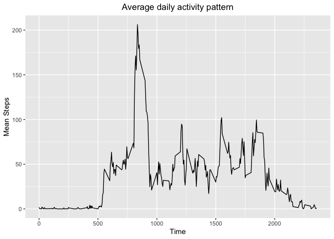
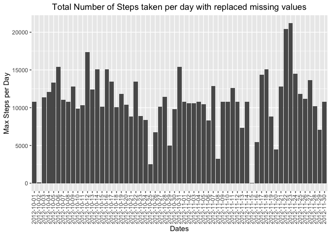
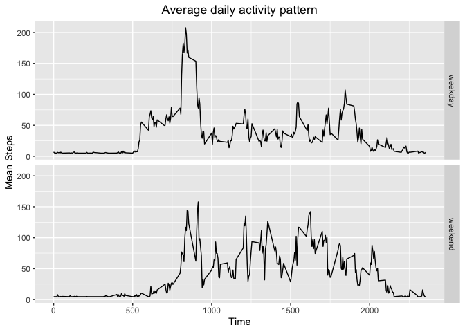

## Loading and preprocessing the data

This section read the dataset and preprocessing all data to be plot, present for the next sections of this document.
The dataset activity.csv it was provided by the instructor to be analysed in this Assessment.


```r
# Reference Libraries
library(ggplot2)

# Load dataset from file
data <- read.csv("activity.csv", header=TRUE)
```

## What is mean total number of steps taken per day?

To answer this question is necessary to plot each day the total number of steps identified according with the plot bellow. The missing values it was dropped for this plot.


```r
# read sum total number of steps taken per day
totstepday <- aggregate(data$steps, by=list(data$date), sum)

# Rename coluns
colnames(totstepday) <- c("date", "totalSteps")

# Plot data
ggplot(totstepday, aes(x=date, y=totalSteps)) + geom_bar(stat="identity") + theme(axis.text.x = element_text(angle = 90, vjust = 0.4, hjust = 1), plot.title = element_text(hjust = 0.5)) + ylab("Max Steps per Day") + xlab("Dates") + ggtitle("Total Number of Steps taken per day")
```

```
## Warning: Removed 8 rows containing missing values (position_stack).
```

<!-- -->

```r
#Summary data
summ <- summary(data$steps)

myMean <- summ[[4]]
myMedian <- summ[[3]]
```

* Mean = <b>37.3825996</b>
* Median = <b>0</b>

## What is the average daily activity pattern?

Is not possible to plot from original dataset the average daily pattern activity including missing values. For this plotting is considering OMIT NAs and ploting the patterns without NAs 


```r
datacln <-  na.omit(data)

# Get mean for each timeseries interval of all days
avgsteptime <- aggregate(datacln$steps, by=list(datacln$interval), mean)

#Rename coluns
colnames(avgsteptime) <- c("time", "meanSteps")

# Plot the mean of all measures pattern in a day.
ggplot(avgsteptime, aes(x=time, y=meanSteps)) + geom_line() + theme(plot.title = element_text(hjust = 0.5)) + ylab("Mean Steps") + xlab("Time") + ggtitle("Average daily activity pattern")
```

<!-- -->

```r
# get the max meanSteps value ploted
m <- max(avgsteptime$meanSteps)

# get full row from MAX.
d <- avgsteptime[which(avgsteptime$meanSteps == m),]
```

For which 5-minute interval, on average across all the days in the dataset, contains the maximum number of steps are <b>835</b> and Time <b>206.1698113</b> Mean Steps

## Imputing missing values


```r
# Count NAs values
nas <- sum(is.na(data))
```

The total number of rows with verb NAs for this dataset are <b>2304</b>.


```r
# New data set to replace missing values
nData <- data

# Replacing missing values with mean
for(i in 1:ncol(nData)){
   nData[is.na(nData[,i]), i] <- mean(nData[,i], na.rm = TRUE)
}
```

```
## Warning in mean.default(nData[, i], na.rm = TRUE): argument is not numeric or
## logical: returning NA
```

```r
# read sum total number of steps taken per day
totstepday2 <- aggregate(nData$steps, by=list(nData$date), sum)

# Rename coluns
colnames(totstepday2) <- c("date", "totalSteps")

# Plot data
ggplot(totstepday2, aes(x=date, y=totalSteps)) + geom_bar(stat="identity") + theme(axis.text.x = element_text(angle = 90, vjust = 0.4, hjust = 1), plot.title = element_text(hjust = 0.5)) + ylab("Max Steps per Day") + xlab("Dates") + ggtitle("Total Number of Steps taken per day with replaced missing values")
```

<!-- -->

```r
#Summary data
summ2 <- summary(nData$steps)

myMean1 <- summ2[[4]]
myMedian1 <- summ2[[3]]
```

* Mean = <b>37.3825996</b>
* Median = <b>0</b>

Including the mean value to replace missing values in dataset the mean and the median is the same of the original dataset. This means that the dataset is not affected by the inclusion of the missing values. 

## Are there differences in activity patterns between weekdays and weekends?


```r
library(chron)
```

```
## Warning: package 'chron' was built under R version 4.0.2
```

```
## NOTE: The default cutoff when expanding a 2-digit year
## to a 4-digit year will change from 30 to 69 by Aug 2020
## (as for Date and POSIXct in base R.)
```

```r
# Set column as date
nData$date <- as.Date(nData$date)

# Create a vector of weekdays
nData$weekDay <- chron::is.weekend(nData$date)
nData$weekDay <- factor(nData$weekDay, labels=c("weekday", "weekend"))

# get mean by timeseries
avgsteptime2 <- aggregate(nData$steps, by=list(nData$interval, nData$weekDay), mean)

colnames(avgsteptime2) <- c("time", "weekDay", "meanSteps")

# Plot the mean of all measures pattern in a day.
ggplot(avgsteptime2, aes(x=time, y=meanSteps)) + geom_line() + theme(plot.title = element_text(hjust = 0.5)) + ylab("Mean Steps") + xlab("Time") + ggtitle("Average daily activity pattern") + facet_grid(weekDay ~.)
```

<!-- -->
